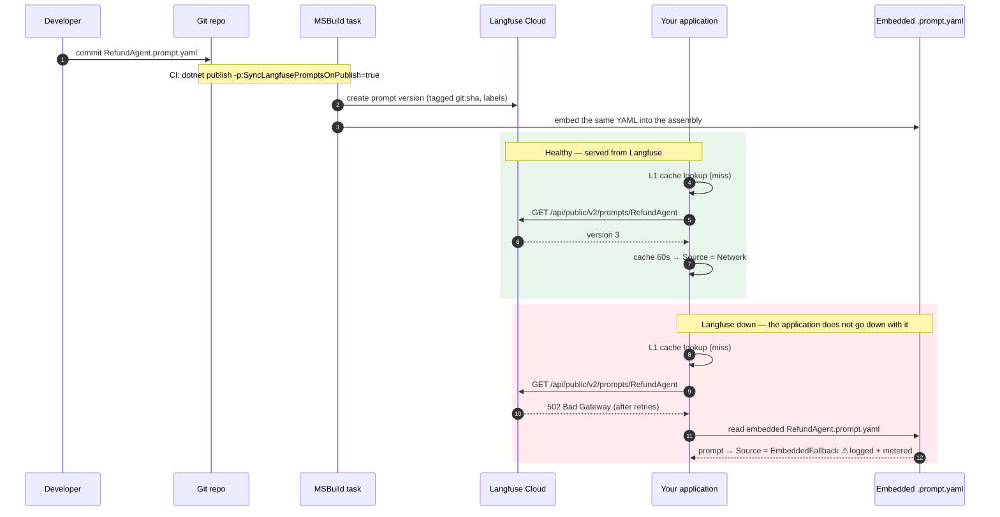

# EnterpriseLangfuse.NET

[](https://dotnet.microsoft.com/)
[](#native-aot)
[](#testing)
[](https://www.nuget.org/)
[](#license)

**Enterprise LLMOps orchestration for .NET.** Built on the
[Langfuse AutoSDK](https://www.nuget.org/packages/Langfuse) for transport and auth, adding the
workflow and resilience layer production systems need:

- **Zero-downtime prompts** — a Langfuse outage degrades to the prompt compiled into your assembly, not a 500 to your user.
- **Compile-time type safety** — a Roslyn generator turns `.prompt.yaml` files into typed methods; a missing variable is a build error, not a malformed prompt at 3am.
- **Code-as-truth (GitOps)** — an MSBuild task syncs version-controlled prompts to Langfuse, tagged with the git commit that produced them.
- **Zero-touch tracing** — a `Microsoft.Extensions.AI` `DelegatingChatClient` captures model, tokens, tools and timings without touching your call sites.
- **Never on the hot path** — recording telemetry costs ~2 µs and never waits on Langfuse.

---

## Contents

- **[Runnable sample](samples/RefundAgent)** — `dotnet run --project samples/RefundAgent`, no configuration needed
- [Install](#install) · [Quick start](#quick-start) · [How it works](#how-it-works)
- [Zero-downtime prompts](#zero-downtime-prompts) · [Typed prompts](#typed-prompts) · [GitOps sync](#gitops-sync) · [Tracing](#tracing)
- [Benchmarks](#benchmarks) · [Native AOT](#native-aot) · [Testing](#testing)
- [Relationship to the AutoSDK](#relationship-to-the-autosdk) — **read this before adopting**

---

## Install

```bash
dotnet add package EnterpriseLangfuse.Core
dotnet add package EnterpriseLangfuse.Extensions.AI   # MEAI tracing
dotnet add package EnterpriseLangfuse.Generators      # typed prompts (analyzer)
dotnet add package EnterpriseLangfuse.MSBuild         # GitOps sync (build-time)
```

Requires **.NET 10**. (The AutoSDK this builds on ships `net10.0` only — see
[Relationship to the AutoSDK](#relationship-to-the-autosdk).)

> **Try it first.** [`samples/RefundAgent`](samples/RefundAgent) runs with no keys and no LLM
> account: `dotnet run --project samples/RefundAgent`. With nothing configured it points at an
> unreachable host on purpose, so you watch the offline fallback keep the app alive.

## Quick start

```csharp
builder.Services.AddEnterpriseLangfuse(options =>
{
    options.PublicKey   = builder.Configuration["Langfuse:PublicKey"]!;
    options.SecretKey   = builder.Configuration["Langfuse:SecretKey"]!;
    options.Environment = builder.Environment.EnvironmentName;
});

// Trace every LLM call through this pipeline.
builder.Services.AddChatClient(new AnthropicChatClient(apiKey))
                .UseFunctionInvocation()
                .UseLangfuse();
```

```csharp
public class RefundService(IPromptProvider prompts, IChatClient chat)
{
    public async Task<string> HandleAsync(string customerName, string orderId)
    {
        // Generated from RefundAgent.prompt.yaml — parameters are compiler-enforced.
        var prompt = await prompts.GetRefundAgentPromptAsync(customerName, orderId);

        var options = new ChatOptions { ModelId = "claude-opus-4-8" }
            .WithLangfusePrompt(prompt);   // links the generation to this prompt revision

        var response = await chat.GetResponseAsync(prompt.ToChatMessages(), options);
        return response.Text;
    }
}
```

## How it works



## Zero-downtime prompts

`IPromptProvider` is a three-tier pipeline. Each tier exists for a reason:

| Tier | What it does | Why |
| :--- | :--- | :--- |
| **L1** `CachingPromptProvider` | `IMemoryCache`, 60s TTL, **request coalescing** | Keeps the API off the hot path. Coalescing means 50 concurrent callers on a cold cache produce **one** fetch, not 50 — a stampede that would otherwise hit Langfuse hardest at startup and at every expiry. |
| **L2** `LangfusePromptProvider` | Fetch over HTTP, with retry + circuit breaker | Turns a transient blip into a non-event before the fallback is ever considered. |
| **L3** `FallbackPromptProvider` | Serve the embedded `.prompt.yaml` | The application keeps working when Langfuse does not. |

Two behaviours worth knowing:

**`Source` tells you when you are degraded.** It describes where the *content* came from
(`Network` or `EmbeddedFallback`) and survives caching, so a cached fallback still reports as a
fallback. Re-tagging it as "cache" would hide exactly the thing worth alarming on. Cache hit rate is
a metric (`enterpriselangfuse.prompt.cache_hits`), not a property.

**Only recoverable failures fall back.** 5xx, timeouts, connection errors, 404s and unparseable
payloads serve the embedded copy. A cancelled request does **not** — a caller who gave up should not
be handed a stale prompt.

```csharp
var prompt = await prompts.GetPromptAsync("RefundAgent");
if (prompt.Source == PromptSource.EmbeddedFallback)
{
    // Langfuse is unreachable; we're serving the compiled-in copy.
}
```

## Typed prompts

Add the YAML as **both** `AdditionalFiles` (drives codegen) and `EmbeddedResource` (the offline
fallback):

```xml
<ItemGroup>
  <AdditionalFiles Include="Prompts/*.prompt.yaml" />
  <EmbeddedResource Include="Prompts/*.prompt.yaml" />
</ItemGroup>
```

```yaml
# Prompts/RefundAgent.prompt.yaml
name: RefundAgent
type: chat
labels: [production]
config:
  model: claude-opus-4-8
  temperature: 0.2
messages:
  - role: system
    content: You are a refund agent. Be concise.
  - role: user
    content: "Customer {{customerName}} is asking about order {{orderId}}."
```

The generator emits a method whose parameters are the prompt's variables:

```csharp
var prompt = await prompts.GetRefundAgentPromptAsync(
    customerName: "Ada",
    orderId: "A-42");        // omit one → compile error, not a broken prompt in production
```

Malformed YAML is reported as diagnostic `ELF001` on the file rather than thrown — a generator that
throws breaks the consumer's IDE.

## GitOps sync

```bash
dotnet build -t:SyncLangfusePrompts \
  -p:LangfusePublicKey=$LANGFUSE_PUBLIC_KEY \
  -p:LangfuseSecretKey=$LANGFUSE_SECRET_KEY
```

Prompts are pushed tagged with the git commit (`git:abc123…`), resolved from CI variables
(`GITHUB_SHA`, `BUILD_SOURCEVERSION`, …) or `git rev-parse`, degrading to no tag when git is absent
rather than failing the build.

The publish hook is **opt-in** (`-p:SyncLangfusePromptsOnPublish=true`) and defaults to off:
silently pushing prompts to a live Langfuse on every developer's `dotnet publish` is not a default
anyone should get by accident. Rehearse with `-p:SyncLangfusePromptsDryRun=true`.

## Tracing

`UseLangfuse()` records model, token usage (including separately-billed cached and reasoning
tokens), tool calls, timings, errors, and — for streamed responses — **time to first token**.
Langfuse trace ids are the ambient **W3C** trace id, so a Langfuse trace and your OpenTelemetry trace
are the same trace under two names.

```csharp
builder.Services.AddChatClient(inner)
       .UseFunctionInvocation()
       .UseLangfuse(o =>
       {
           o.UserIdAccessor = () => httpContextAccessor.HttpContext?.User.GetUserId();
           o.CaptureContent = true;   // false keeps prompt/response text out of Langfuse
       });
```

`CaptureContent` defaults to **true** — inspecting inputs and outputs is the point of an LLM
observability tool. Set it to `false` for regulated data and you still get timings, tokens and cost.

## Benchmarks

Every performance claim above is measured by [`benchmarks/`](benchmarks/EnterpriseLangfuse.Benchmarks).
Reproduce them:

```bash
dotnet run -c Release --project benchmarks/EnterpriseLangfuse.Benchmarks -- --filter '*'
```

<sub>AMD Ryzen AI 7 350, 16 logical cores · .NET 10.0.8, X64 RyuJIT AVX-512 · Windows 11 25H2 · BenchmarkDotNet v0.15.8</sub>

**Prompt pipeline** — the steady-state cost of resolving a prompt (DefaultJob):

| Benchmark | Mean | Allocated |
| :--- | ---: | ---: |
| Resolve prompt (L1 cache hit) | **66 ns** | 160 B |
| Resolve prompt (cache miss, *stub* transport) | 4,072 ns | 8,976 B |
| Resolve prompt (Langfuse down → embedded fallback) | 7,945 ns | 4,576 B |
| Compile prompt (2 variables, 2 messages) | **84 ns** | 504 B |

The cache-miss and fallback rows use an in-memory stub transport with **no network**, so they measure
this library's overhead only. A real fetch is dominated by network latency, so the cache-hit
advantage in production is *larger* than shown here, never smaller.

Note the shape of the fallback row: **serving a prompt through a total Langfuse outage costs
microseconds.** Staying up is not a slow path.

**Telemetry** — why the background channel exists (ShortRun; the 10 ms arm makes a full job needlessly slow):

| Benchmark | Mean | Ratio | Allocated |
| :--- | ---: | ---: | ---: |
| Track generation (background channel) | **2.18 µs** | 1.00 | 1.41 KB |
| Track generation (synchronous, 0 ms server — CPU only) | 2.29 µs | 1.05 | 4.02 KB |
| Track generation (synchronous, 10 ms server — realistic) | 15,602 µs | **7,151×** | 4.84 KB |

<sub>The 10 ms arm measures 15.6 ms because Windows timer granularity rounds `Task.Delay(10ms)` up; the
delay is a stand-in for a Langfuse round trip, and the conclusion is unaffected by the exact figure.</sub>

The middle row is the honest control, and it is there on purpose: against a server that answers
instantly the channel is **not** faster — it does the same serialisation and wins only on
allocations. The channel is not a CPU optimisation. Its value is the third row: the caller's cost of
inline dispatch *is* the network round trip, and the channel removes it from the request path
entirely. Quoting a speedup from the middle row would be dishonest; the third row is the claim.

## Native AOT

All shipping libraries build with `<IsAotCompatible>true</IsAotCompatible>`, and this is enforced
rather than asserted:

- **Analysers on.** `EnableAotAnalyzer` + `EnableTrimAnalyzer`, warnings-as-errors. They caught real
  defects during development: reflection-based options validation (`IL2026`), and
  `JsonValue.Create<T>`/`JsonArray.Add<T>`, whose generic overloads are `RequiresDynamicCode`.
- **Whole-graph trim analysis.** `tests/EnterpriseLangfuse.AotSmokeTest` publishes trimmed and
  self-contained with **zero** `IL2xxx`/`IL3xxx` warnings across the full dependency graph.
- **Behaviour verified after trimming.** The smoke test does not merely link — it *executes* the six
  paths reflection would break (source-generated JSON, runtime YAML parsing, telemetry dispatch, MEAI
  tracing, options validation, prompt compilation) and asserts the results. All six pass on a trimmed
  binary.

Design consequences: serialisation is source-generated `System.Text.Json`; runtime YAML uses
YamlDotNet's reflection-free `YamlStream` DOM, never its `Deserializer`; options validation is
hand-written rather than `ValidateDataAnnotations`.

> **Scope of verification.** Native AOT *codegen* was not run on the development machine, which has
> no MSVC linker. Verified to date: AOT/trim analysers clean, ILLink whole-graph trim analysis clean,
> and the smoke test passing on a trimmed self-contained binary. Run
> `dotnet publish tests/EnterpriseLangfuse.AotSmokeTest -c Release -r win-x64` on a machine with C++
> build tools to complete the native link.

## Testing

**239 tests** (232 offline + 7 against a live Langfuse). **93.7% line coverage** (Core 93.1%,
Extensions.AI 96.0%), generated code excluded.

```bash
dotnet test
dotnet test --collect:"XPlat Code Coverage" --settings coverlet.runsettings
```

| Suite | Tests | Covers |
| :--- | ---: | :--- |
| `Core.Tests` | 128 | Resilience pipeline, cache coalescing, telemetry channel, dispatcher, DI wiring |
| `Extensions.AI.Tests` | 37 | Tracing, streaming, W3C correlation, prompt linking, content capture |
| `Generators.Tests` | 33 | Snapshot tests, generated-code compilation, diagnostics |
| `MSBuild.Tests` | 34 | Sync task, dry run, git resolution, credential handling |
| `LiveValidation` | 7 | Real Langfuse: wire contracts, prompt round-trip, ingestion — see below |

### Verified against a real Langfuse

Every offline suite stubs HTTP against *this library's own* assumptions about the wire format. Since
`Core` replaced the AutoSDK's models with hand-written contracts, a wrong field name would be written
wrongly, read back wrongly, and every test would still pass while production silently broke. No
amount of mocking closes that gap.

[`tests/EnterpriseLangfuse.LiveValidation`](tests/EnterpriseLangfuse.LiveValidation) closes it, by
talking to a real Langfuse and verifying reads with raw `JsonDocument` against the field names
Langfuse documents — never through this library's own deserialisation, which would make the check
circular. **All 7 pass against Langfuse Cloud**, confirming:

- a text prompt round-trips **as text** (the AutoSDK's discriminator reports it as chat);
- a chat prompt round-trips **with its messages** (the AutoSDK returns a null body);
- `production` and `staging` labels resolve to different versions;
- a missing prompt surfaces as `PromptNotFoundException`, not as an outage;
- traces and generations arrive **with their bodies** — name, user, session, release, environment,
  input, model and `usageDetails` all present and correct;
- Langfuse accepts every event type this library emits (`trace`, `span`, `generation`, `score`) with
  `"errors":[]`.

They skip themselves when credentials are absent, so `dotnet test` stays green offline:

```bash
export LANGFUSE_PUBLIC_KEY=pk-lf-...   # or langfuse.local.env at the repo root
export LANGFUSE_SECRET_KEY=sk-lf-...
dotnet test tests/EnterpriseLangfuse.LiveValidation
```

> **Ingestion is asynchronous, and reads are rate-limited.** A `201` means *queued*, not *visible*
> (a trace took ~33s to become queryable against Langfuse Cloud), and `GET /traces/{id}` is limited
> to 15/min — so these tests poll on a 5s cadence with a 120s budget and treat 429 as retryable.
> Assert on a single read after writing and you will get a flaky suite.

The resilience suite does what the spec asks: forces `502`s (plus timeouts, connection resets, 404s
and unparseable bodies) through a stubbed `HttpMessageHandler` and asserts the embedded YAML is
served without application failure — and that it is *usable*, compiled through to rendered output.

Coverage excludes source-generated code. Counting it would put the denominator in the thousands of
machine-written lines and produce a number that says nothing about the tests.

## Relationship to the AutoSDK

This framework sits above the [Langfuse AutoSDK](https://www.nuget.org/packages/Langfuse) and uses it
for transport, authentication and prompt creation. **It does not use the AutoSDK's models for
ingestion or prompt reads**, because they cannot round-trip those payloads. Verified against
`Langfuse` 1.0.0:

- Its `AllOf<T1,T2>` JSON converter serialises **only** `Value1` and drops `Value2`. An ingestion
  event therefore serialises to `{"type":"trace-create"}` — the entire body silently lost.
- On read, `Value2` comes back `null`, and the `Prompt` union's discriminator always selects the
  first variant, so a `"type":"text"` prompt is misreported as chat.
- The converter cannot be replaced from outside: it lives in the SDK's baked source-generation
  context, and cloning the options breaks the resolver binding.

So `EnterpriseLangfuse.Core` defines its own wire contracts with a source-generated
`System.Text.Json` context for those two endpoints. This is not gratuitous reinvention — it is why
telemetry sent through this library arrives with a body, and why a text prompt is read as text. The
AutoSDK is still used where it is correct, including `CreatePromptRequest` in the MSBuild sync task.

A runnable reproduction of all three defects, plus a verified fix, is in
[`contrib/autosdk-allof-bug`](contrib/autosdk-allof-bug) — ready to file against
[tryAGI/AutoSDK](https://github.com/tryAGI/AutoSDK/issues). Run `cd contrib/autosdk-allof-bug/Repro
&& dotnet run`: exit code 0 means upstream has fixed it and this library can go back to the SDK's
models.

`ILangfuseClient` is registered in DI, sharing the same resilient `HttpClient`, so the rest of the
Langfuse API remains available to you directly.

## Configuration

| Option | Default | Notes |
| :--- | :--- | :--- |
| `PromptCacheDuration` | `60s` | L1 TTL. |
| `FallbackCacheDuration` | `10s` | Shorter on purpose — a 60s fallback cache keeps serving stale prompts long after Langfuse recovers. |
| `EnableOfflineFallback` | `true` | Set `false` to fail loudly instead of serving a possibly stale prompt. |
| `TelemetryQueueCapacity` | `10,000` | Bounded: an unbounded queue turns a Langfuse outage into a memory leak. |
| `TelemetryBatchSize` / `TelemetryFlushInterval` | `100` / `5s` | Batching. |
| `OverflowPolicy` | `DropNewest` | `DropNewest` or `DropOldest`. There is no "block" policy: `ILangfuseTelemetry` is synchronous and contractually never blocks. |
| `ShutdownDrainTimeout` | `10s` | Time-boxed drain, so an unreachable Langfuse cannot hang a deployment. |

## Observability of the framework itself

Meter `EnterpriseLangfuse` — these answer "is the framework healthy?":

| Instrument | Watch for |
| :--- | :--- |
| `enterpriselangfuse.prompt.fallbacks` | **Any sustained rate means you are serving stale prompts.** |
| `enterpriselangfuse.telemetry.dropped` | **Any value means traces are being lost.** |
| `enterpriselangfuse.prompt.cache_hits` / `.cache_misses` | Cache effectiveness. |
| `enterpriselangfuse.telemetry.ingestion.duration` | Langfuse ingestion latency. |

## License

MIT.
